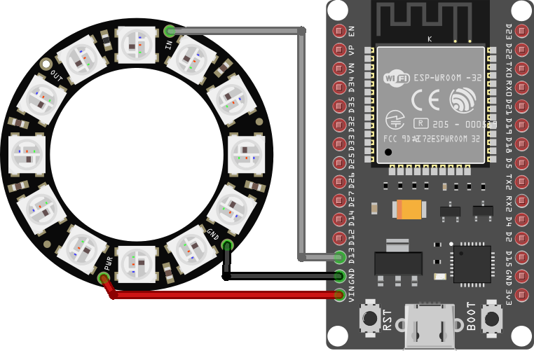

# Build Monitor

This project uses an ESP32 module connected to a NeoPixel array to display the status of a CircleCI build (passing, building or failing).

## Components
* ESP32 module
* NeoPixel array (strip or ring)
* 3x socket-to-socket wires

With the ESP32 module disconnected from your laptop

1. Connect a wire between the `gnd` pin of the ESP32 module and the `gnd` pin of the NeoPixel array.
2. Connect a wire between the `vin` pin of the ESP32 module and the `pwr` pin of the NeoPixel array.
3. Connect a wire between the `d13` pin of the ESP32 module and the `in` pin of the NeoPixel array.

## Developing

After connecting the ESP32 module to your laptop, set up a new PlatformIO project as described in the [README](../README.md#getting-started-with-platformio).

Load up the `build-monitor` project into PlatformIO, the entrypoint is `main.cpp`. Follow the steps below to understand what is being added in each step.

### [Step 1](src/BuildMonitorStep1.cpp)

* Start a `Serial` connection (great for debugging) 
* Start the NeoPixel strip
  * You will need to set `NEOPIXEL_LENGTH` appropriately based on your NeoPixel array)
* Set all of the NeoPixels to a plain white colour

### [Step 2](src/BuildMonitorStep2.cpp)

* Set up a WIFI connection
  * You will need to copy `include/secrets.h.example` to `include/secrets.h` and populate it. Don't commit it anywhere!

### [Step 3](src/BuildMonitorStep3.cpp)

* Communicate with CircleCI to get information about a build and work out its status (building, passing, failing or unknown)
* Write out the build status to `Serial`.

### [Step 4](src/BuildMonitorStep4.cpp)

* Use the build status to display a certain colour for different build statuses

### [Step 5](src/BuildMonitorStep5.cpp)

* Display a progress spinner for the "building" status