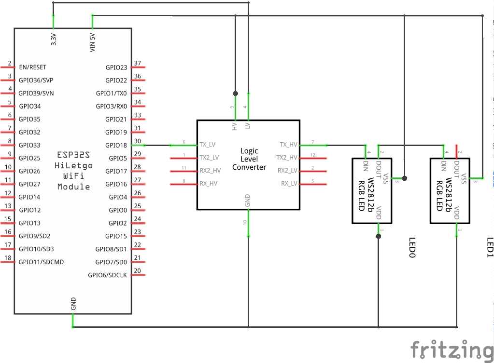

# Glowing Eyes

This project uses an ESP32 module connected to a pair of neopixel LEDs to make them glow!

You could sew these leds into a plushie for extra effect.

The follow up to this project is [glowing-eyes-connected](../glowing-eyes-connected/README.md) where we connect the ESP32 to an MQTT broker so that the glow can be remotely triggered

## Components
* ESP32 module
* voltage converter
* 2x neopixel LEDs

With the ESP32 module disconnected from your laptop

1. Connect a wire between the `gnd` pin of the ESP32 module and the `gnd` pin of the voltage converter.
2. Connect a wire between the `3v3` pin of the ESP32 module and the `low voltage` pin of the voltage converter.
3. Connect a wire between the `d18` pin of the ESP32 module and the `low voltage 1` pin of the voltage converter.
4. Connect a wire between the `5v` pin of the ESP32 module and the `high voltage` pin of the voltage converter.
5. Connect a wire between the `high voltage` pin of the voltage converter and the `vin` pin of the first LED
6. Connect a wire between the `gnd` pin of the voltage converter and the `gnd` pin of the first LED
7. Connect a wire between the `high voltage 1` pin of the voltage converter and the `data in` pin of the first LED

## Developing

After connecting the ESP32 module to your laptop, set up a new PlatformIO project as described in the [README](../README.md#getting-started-with-platformio).

you can copy the code out of main.cpp in this folder into the your own main.cpp
