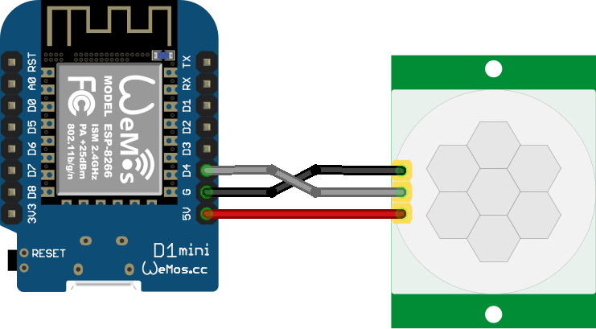

# Motion Sensor

This project uses an ESP32 module connected to a motion sensor to send a "motion detected" message when it detects activity, and then an "all clear" message after a certain period of inactivity.

## Components
* ESP32 module
* Motion sensor
* 3x socket-to-socket wires
* (optional) battery pack

You should have something like this:  
*(picture of Motion Sensor components laid out on a table)*

## Hardware Steps

With the ESP32 module disconnected from your laptop:

1. Connect a wire between the `gnd` terminal of the ESP32 module and the `gnd` terminal of the motion sensor.
2. Connect a wire between the `vcc`/`5v` terminal of the ESP32 module to the `vcc`/`5v` terminal of the motion sensor.
3. Connect a wire between the `gpio2` terminal of the ESP32 module to the `data` terminal of the motion sensor.

## Software steps

After connecting the ESP32 module to your laptop:

1. Start with the [hello-world](hello-world.cpp) example code as a template
2. Set up the `gpio2` pin as an "in" pin. Put the motion sensor inside an enclosed container. Use the serial monitor to view the state of the pin when you move your hand in front of the motion sensor.
3. Install an MQTT pub/sub library. Test it out by sending messages to the "hello-world" topic at `mqtt.svr.ip.addr`.
4. Work out how you'll use the `setup` and `loop` methods to detect motion and send messages for "motion detected" and "all clear" events.