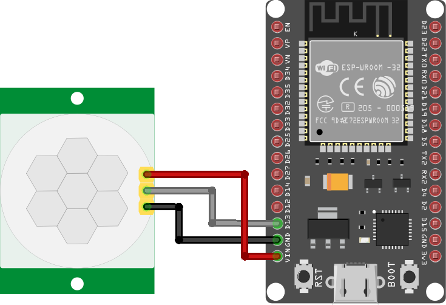

# Motion Sensor

This project uses an ESP32 module connected to a motion sensor to send a "motion detected" message when it detects activity.

## Components
* ESP32 module
* Motion sensor
* 3x socket-to-socket wires

With the ESP32 module disconnected from your laptop

1. Connect a wire between the `gnd` pin of the ESP32 module and the `gnd` pin of the motion sensor.
2. Connect a wire between the `vin` pin of the ESP32 module and the `vcc`/`5v` pin of the motion sensor.
3. Connect a wire between the `d13` pin of the ESP32 module and the `out` pin of the motion sensor.

## Developing

After connecting the ESP32 module to your laptop, set up a new PlatformIO project as described in the [README](../README.md#getting-started-with-platformio).

This project comes with 5 include files, each building on the last to progressively guide you
through the steps of this exercise.

You can use these examples by bringing each one into the `Main.cpp` file.

* Step 1 - Make the LED blink
* Step 2 - Add Serial monitoring
* Step 3 - Add WiFi
* Step 4 - Add MQTT
* Step 5 - Add Motion Sensor

See [motion sensor steps](include/README.md) for more details on each step.

