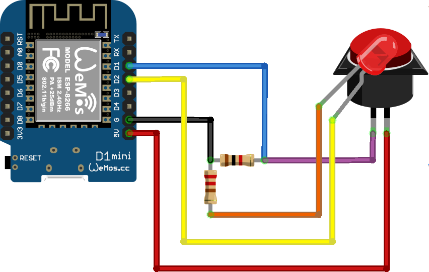

# Remote toggle

This project uses an ESP8266 module (soon an ESP32) connected to a LED light and button to act as a remote trigger.

## Components
* ESP8266 module
* LED pushbutton
* Wires and resistors

With the ESP8266 module disconnected from your laptop, follow the steps in the screenshot above.

## Developing

After connecting the ESP8266 module to your laptop, set up a new PlatformIO project as described in the [README](../README.md#getting-started-with-platformio).

Copy `lib/secrets.h.example` to `lib/secrets.h` and populate all of the details. Do not commit this file.

Then upload `main.cpp` to the ESP8266.
